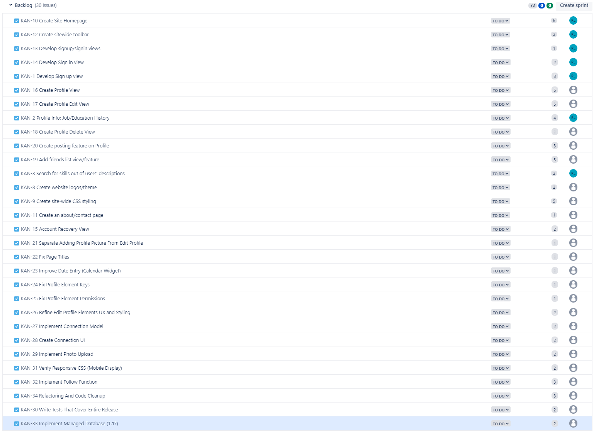
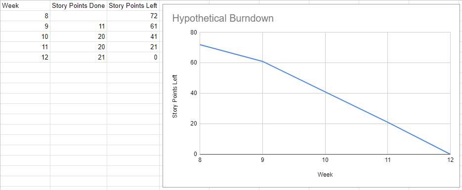

# Product Backlog and Burndown Graph

* Added issues discovered in customer acceptance meeting to backlog
* Added issues discovered in usability test to product backlog
* Looked for and found more issues until product backlog had 30 issues
* Created a hypothetical burndown graph for the work using the most recent pace

## Product Backlog

## Burndown Graph

